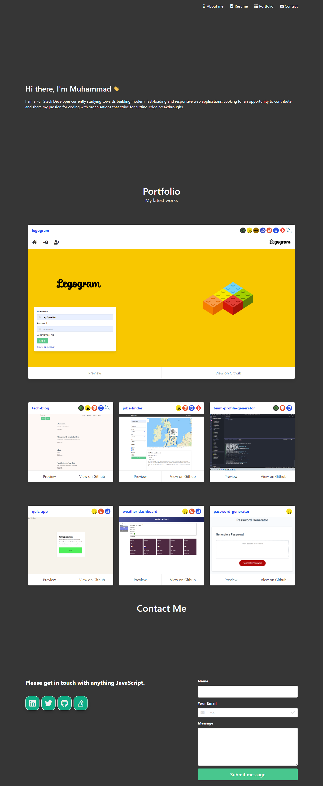
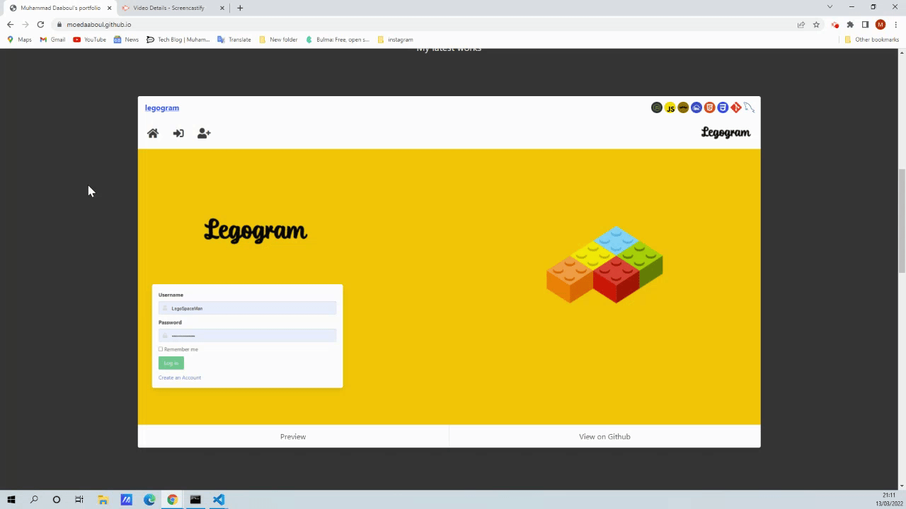

# js-portfolio

This is a portfolio site using JavaScript and the Github API
Live demo [_here_](https://moedaaboul.github.io/js-portfolio/).

## Table of Contents

- [General Info](#general-information)
- [Appearance](#appearance)
- [Github stats](#github-api)
- [Technologies Used](#technologies-used)
- [Setup](#setup)
- [Project Status](#project-status)
- [Contact](#contact)
- [License](#license)

## General Information

The purpose of this app is to showcase my portfolio.

- App displays contact information via a contact section where messages can be sumbitted via Formspree.
- Links to Github and LinkedIn have been provided in the contact section
- Details around commits, license, and description presented via a modal.
- Job modal info fetched from the Github API
- App showcases projects and workshops with at least 20 commits.
- Screenshot or gifs of repositories provided in cards and modal views.
- Polished interface with smooth scrolling and links to downloadable pdf resume.

## Appearance

Below depicts full home page view of my portfolio app:

## Github API

Below depicts github stats, slider demo and views functionality per showcased single repo:

## Technologies Used

- Github API
- IntersectionObserver API
- JavaScript
- HTML
- CSS
- Bulma framework
- Font Awesome
- Formspree

## Setup

-Text editor (VS Code recommended)
-An Internet browser (Google Chrome recommended)

## Project Status

Project is: complete.

## Acknowledgements

- www.freeicons.io
- www.vectorlogo.zone

## Contact

Created by -[@moedaaboul](https://github.com/moedaaboull)

- Feel free to contact me!

## LICENSE

This work is licensed under
[MIT](https://github.com/moedaaboul/moedaaboul.github.io/blob/main/LICENSE).
